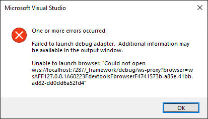
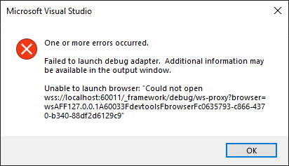

# MyApp

This sample was created from [.NET Aspire Starter](https://learn.microsoft.com/en-us/dotnet/aspire/get-started/build-your-first-aspire-app?tabs=visual-studio) and sample from [Blazor Webassembly Excel add-in](https://github.com/OfficeDev/Office-Add-in-samples/tree/main/Samples/blazor-add-in/excel-blazor-add-in).

# Changes
- Keep only the ```https``` profile
- Add ```inspectUri": "{wsProtocol}://{url.hostname}:{url.port}/_framework/debug/ws-proxy?browser={browserInspectUri}``` to the ```launchSettings.json``` file in the ```MyApp.Web``` project

# Issue
Debug session starts and after one minute, breaks with the 2 following error messages :


