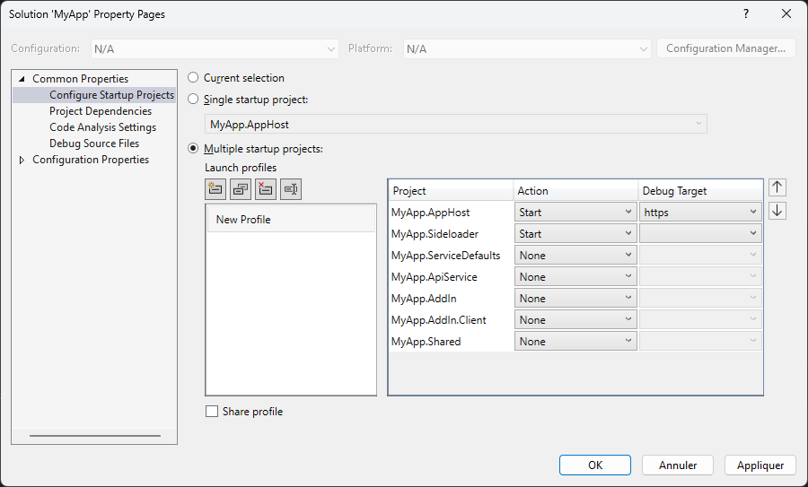

# MyAspireBlazorAddIn
This sample was created from [.NET Aspire Starter](https://learn.microsoft.com/en-us/dotnet/aspire/get-started/build-your-first-aspire-app?tabs=visual-studio) and sample from [Blazor Webassembly Excel add-in](https://github.com/OfficeDev/Office-Add-in-samples/tree/main/Samples/blazor-add-in/excel-blazor-add-in).

# Changes
- Keep only the ```https``` profile.
- Add a new Blazor Web Application for the Excel Add-in.

# Startup from Visual Studio


# Issue
See https://learn.microsoft.com/en-us/answers/questions/1150659/uncaught-typeerror-history-pushstate-is-not-a-func
